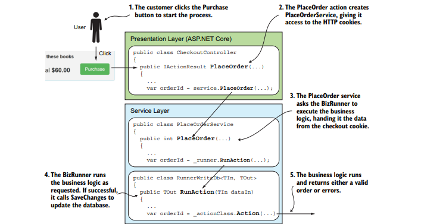

### 第四章 在业务逻辑中使用efcore

本章涵盖

* 理解业务逻辑和使用
* 使用模式来构建业务逻辑
* 通过一个业务逻辑示例
* 在数据写入数据库之前增加验证
* 将事务转换为菊花链代码序列

构建真实世界的应用程序是为了提供一系列服务，从在计算机上保存一个简单的列表到管理一个核反应堆。现实世界中的每个问题都有一组规则，通常称为业务规则，或者更通用的名称域规则(本书使用业务规则)。

您为实现业务规则而编写的代码称为业务逻辑或域逻辑。因为业务规则可能很复杂，所以您编写的业务逻辑也可能很复杂。想想当你在网上订购东西时应该做的所有检查和步骤。

业务逻辑的范围可以从简单的状态检查到大规模的人工智能
(AI)代码，但在几乎所有情况下，业务逻辑都需要访问数据库。尽管第2章和第3章中的方法都会发挥作用，但在业务逻辑中应用这些EF Core命令的方式可能略有不同，这就是我编写本章的原因

本章描述了一种处理业务逻辑的模式，该模式划分了一些复杂性，以减少开发人员的负担。您还将学习编写使用EF Core访问数据库的业务逻辑的几种技术。这些技术的范围从使用软件类进行验证到标准化业务逻辑接口以简化前端代码

#### 4.1 为什么业务逻辑与其他代码如此不同

第2章和第3章中的CRUD代码在数据移入和移出数据库时对数据进行调整和转换。有些代码有点复杂，我给你们看了
查询对象模式，使大型查询更易于管理。相反，业务逻辑的复杂性可以达到一个全新的水平。这里引用了一本关于编写业务逻辑的主要书籍

<font bgcolor="red" color="red" face="黑体" size=2>软件的核心是为用户解决领域(业务)相关问题的能力。所有其他的功能，尽管它们可能很重要，但都支持这个基本目的。当领域复杂时，这是一项艰巨的任务，需要有才能和技术人员的集中努力</font>

多年来，我编写了相当多的复杂业务逻辑，我找到了Eric
埃文的评论“这是一项艰巨的任务”是真的。当我在很长一段时间后回到软件开发时，我编写的第一个应用程序是用于地理建模和优化的，这些应用程序具有复杂的业务规则。我写的商业代码最后有几百行，全都交织在一起. 代码可以工作，但是很难理解、调试和维护

所以，是的，您可以像编写任何其他代码一样编写业务逻辑，但是有一种更深思熟虑的方法。下面是在编写业务逻辑时应该问的几个问题

* 你是否完全理解你正在执行的业务规则?  
* 有什么特殊情况或例外情况需要考虑吗?
* 你如何证明你的实现是正确的?
* 如果业务规则发生变化，修改代码有多容易?
* 如果代码需要修改，你或其他人能理解吗?

#### 4.2 我们公司需要处理一笔购书订单

让我们从描述我们想要实现的业务问题开始。您将使用的示例是处理用户的图书订单。图4.1显示了我们的图书应用程序的结帐页面。您将实现当用户单击
购买按钮。


<center>
图4.1图书应用程序的结帐页面。单击Purchase调用业务逻辑来创建订单
</center>

<font bgcolor="red" color="red" face="黑体" size=2>

    您可以在现场网站http://efcoreinaction上尝试结账过程.com/。该站点使用HTTP cookie保存您的购物篮和您的身份(这样你就不用登录了)。不需要钱——如条款和条件说明，你实际上不会买一本书

</font>

##### 4.2.1 需要实现的业务规则

下面的列表给出了满足此业务需求的规则集。我相信您可以想象，一个真正的订单处理业务逻辑会有更多的步骤，特别是在支付和运输方面，但是这六条规则对于这个例子来说已经足够了

1. 必须在“条款与条件”框中打勾。
2. 一份订单必须至少包括一本书。
3. 一本书必须是可以出售的，以价格为正值来定义。
4. 这本书的价格必须抄写在订单上，因为价格可能会改变。
5. 订单必须记录是谁订购了这些书。
6. 必须向用户提供良好的反馈，以便他们解决订单中的任何问题。

业务规则的质量和数量将随着项目的变化而变化。前面的规则不错，但是它们没有涵盖诸如如果用户选择的书被删除(不太可能，但可能)该怎么办，以及如何清除恶意输入等内容。作为一名开发人员，这就是您需要全面考虑问题并尝试预测问题的地方。

#### 4.3 使用设计模式来帮助实现业务逻辑

在开始编写处理订单的代码之前，您应该描述将要遵循的模式。此模式可帮助您编写、测试和性能调优业务逻辑。该模式基于Eric Evans所阐述的领域驱动设计(DDD)概念，但是业务逻辑代码不在实体类中。这被称为事务脚本或业务逻辑的过程模式，因为代码包含在一个独立的方法中

这个过程模式更容易理解，并且使用了您已经看到的基本EF Core命令。但是许多人将过程方法视为DDD反模式，称为贫血域模型(参见www.martinfowler.com/bliki/AnemicDomainModel.html)。在了解了EF Core的后台字段特性和DDD实体模式之后，您将在10.4.2节中将这种方法扩展为完全的DDD设计

本节和第10.4节介绍了我对Eric Evans的DDD方法的解释，以及在EF中应用DDD的许多其他方法。尽管我提供了我的方法，希望能对你们中的一些人有所帮助，但不要害怕寻找其他方法

##### 4.3.1 构建使用EF Core的业务逻辑的五条准则

下面的列表解释了组成本章将要使用的业务逻辑模式的五条指导原则。大多数模式来自DDD概念，但有些是编写大量复杂业务逻辑并看到需要改进的地方的结果

1. 业务逻辑首先调用如何定义数据库结构。因为您试图解决的问题(Eric Evans称之为领域模型)是问题的核心，所以它应该定义整个应用程序的设计方式。因此，您尝试使数据库结构和实体类尽可能地匹配您的业务逻辑数据需求。
2. 业务逻辑应该没有干扰。编写业务逻辑本身就已经很困难了，因此您可以将其与除实体类之外的所有其他应用层隔离开来。在编写业务逻辑时，必须只考虑要解决的业务问题。您将调整用于表示的数据的任务留给了应用程序中的服务层。
3. 业务逻辑应该认为它正在处理内存中的数据。这是Eric Evans教我的:就像数据在内存中一样编写业务逻辑。当然，您需要一些加载和保存部分，但是对于业务逻辑的核心，请尽可能将数据视为正常的内存类或集合
4. 将数据库访问代码隔离到一个单独的项目中。这个相当新的规则来自于编写具有复杂定价和交付规则的电子商务应用程序。在此之前，我在业务逻辑中直接使用EF，但我发现它很难维护，也很难进行性能调优。相反，您应该使用与业务逻辑配套的另一个项目来保存所有数据库访问代码。
5. 业务逻辑不应该直接调用EF Core的SaveChanges。您应该在服务层(或自定义库)中有一个类，其工作是运行业务逻辑。如果没有错误，这个类调用SaveChanges。使用此规则的主要原因是可以控制是否写入数据，但还有其他好处，我将在后面描述

图4.2显示了您将创建的应用程序结构，以帮助您在实现业务逻辑时应用这些指导原则。在本例中，您将在第2章中描述的原始图书应用程序结构中添加两个新项目:
* 纯业务逻辑项目，它拥有业务逻辑类，这些业务逻辑类处理由其配套的业务数据库访问方法提供的内存数据。
* 业务数据库访问项目，为每个需要访问数据库的纯业务逻辑类提供一个配套类。每个伙伴类都使纯业务逻辑类认为它正在处理内存中的一组数据

图4.2有5个数字和注释，它们与前面列出的5个指导原则相匹配


<center>图4.2图书应用程序内部的项目，其中有两个新项目用于处理业务逻辑</center>

应用程序中的所有业务逻辑都位于BizLogic层吗? 在现实世界的应用程序中，特别是那些与人交互的应用程序，您希望用户体验尽可能好。因此，业务逻辑可能会从BizLogic层移到其他层，尤其是表示层。所以，不，应用程序中的所有业务逻辑并不都存在于BizLogic层。

作为一名开发人员，我发现将客户提供的业务规则的不同部分分为三种类型是很有用的:
* 状态或数据的操作(例如创建订单)
* 验证规则(例如检查是否可以购买一本书)
* 序列或流(例如处理订单的步骤)

状态或数据的操作是核心业务逻辑。这种操作的代码可能很复杂，可能需要大量的设计和编程工作来编写。本章关注的是服务器端业务逻辑，但是有了复杂的前端JavaScript库，一些数据或状态操作可能会移到前端。

数据验证无处不在，因此您会发现验证代码出现在应用程序的每个层中。在面向人类的应用程序中，我通常会将验证尽可能向前推进，以便用户能够快速获得反馈。但是，正如您将在示例中看到的，业务逻辑中可能存在大量额外的验证。

序列或流通常作为向导中的一系列页面或步骤显示给人类用户，但是通过某种CRUD和/或业务逻辑完成的每个阶段所需的数据操作来进行备份。

所有这些都不会使在服务器端应用程序中使用特定区域专门用于业务逻辑的方法无效。有很多复杂的代码需要编写，有一个将业务规则作为首要关注点的区域可以帮助您编写更好的代码。

#### 4.4 实现处理订单的业务逻辑

既然我已经描述了业务需求、业务规则和将要使用的模式，那么就可以开始编写代码了。其目的是将实现分解为更小的步骤，专注于手头问题的特定部分。您将看到此业务逻辑模式如何帮助您依次关注实现的每个部分。

您将在符合4.3.1节中列出的五个准则的章节中实现代码。最后，您将看到如何从ASP调用这些组合代码图书应用程序正在使用的。net Core应用程序。

##### 4.4.1 准则1: 业务逻辑首先调用定义数据库结构

该准则指出，数据库的设计应该遵循业务需求——在本例中，由六条业务规则表示。与数据库设计相关的三个规则如下:“一个订单必须至少包含一本书(暗示可以有更多)。“书的价格必须抄写在订单上，因为价格可能会改变。”订单必须记住是谁订购了这些书。由此，您得到了一个相当标准的订单设计，其中order实体类具有LineItem实体类的集合—一对多关系。Order实体类保存有关下订单的人的信息，而每个LineItem实体类保存对图书订单、数量和价格的引用。图4.3显示了这两个表LineItem和Orders在数据库中的样子。为了使图像更容易理解，我显示了每个LineItem行引用的Books表(灰色)。


<center>图4.3新增的LineItem和Orders表允许订购图书</center>
<font bgcolor="red" color="red" face="黑体" size=2>说明: Orders表名是复数，因为您在应用程序的DbContext中添加了DbSet<Order> Orders属性，并且EF Core默认使用属性名Orders作为表名。您没有为LineItem实体类添加属性，因为它是通过Order的关系链接访问的。在这种情况下，EF Core默认使用类名LineItem作为表名。</font>

##### 4.4.2 准则2: 业务逻辑应该没有干扰

现在您处于业务逻辑代码的核心，这里的代码将完成大部分工作。这将是您编写的实现中最困难的部分，但您希望通过切断任何干扰来帮助自己。这样，你就可以专注于问题

为此，您可以编写纯业务代码，仅引用系统的其他两个部分: 如图4.3所示的实体类Order、LineItem和Book，以及将处理所有数据库访问的伴随类。即使将范围最小化，您仍然需要将工作分成几个部分。

###### 检查错误并将其反馈给用户

验证业务规则包含几个检查，例如“必须勾选条款和条件框”。他们还说，你需要给顾客良好的反馈，这样他们就可以解决任何问题，完成购买。这些类型的检查称为验证，在整个应用程序中都很常见。

为了提供帮助，您将创建一个名为BizActionErrors的小抽象类，如清单4.1所示。这为所有业务逻辑提供了一个通用的错误处理接口。该类包含一个名为AddError的c#方法，业务逻辑可以调用该方法来添加错误，还包含一个名为Errors的不可变列表(不能更改的列表)，其中包含运行业务逻辑时发现的所有验证错误。

您将使用一个名为ValidationResult的类来存储每个错误，因为它是返回带有可选的附加信息的错误的标准方式，这些信息是关于错误与什么属性相关的。使用ValidationResult类而不是简单的字符串适合本章稍后将添加的另一个验证方法。
<font bgcolor="red" color="red" face="黑体" size=2>您有两种主要方法来处理将错误传递回更高级别。一种方法是在发生错误时抛出异常，另一种方法是将错误传递给调用者。每个都有自己的优点和缺点; 本例使用第二种方法——将错误返回给更高的级别进行检查
</font>
<center>清单4.1为业务逻辑提供错误处理的抽象基类</center>


```
//上述清单包含的代码
public abstract class BizActionErrors 
{
    private readonly List<ValidationResult> _errors 
    = new List<ValidationResult>(); 
    public IImmutableList<ValidationResult> 
    Errors => _errors.ToImmutableList();
    public bool HasErrors => _errors.Any(); 
    protected void AddError(string errorMessage, 
    params string[] propertyNames) 
    {
        _errors.Add( new ValidationResult 
            (errorMessage, propertyNames));
    }
}
```

使用这个抽象类意味着您的业务逻辑更容易编写，并且所有业务逻辑都有一致的错误处理方式。另一个优点是，您可以更改内部处理错误的方式，而无需更改任何业务逻辑代码。

处理订单的业务逻辑做了大量的验证; 这在订单中很常见，因为它经常涉及到钱。其他业务逻辑可能不做任何测试，但是基类BizActionErrors将自动返回一个false的HasErrors，这意味着可以用相同的方式处理所有业务逻辑

##### 4.4.3 准则3: 业务逻辑应该认为它正在处理内存中的数据

现在从包含纯业务逻辑的主类PlaceOrderAction开始。它依赖于配套类PlaceOrderDbAccess，将数据作为内存中的集合(在本例中为字典)呈现，并将创建的顺序写入数据库。尽管您没有试图对纯业务逻辑隐藏数据库，但您确实希望它像普通的。net类一样工作。

清单4.2显示了PlaceOrderAction类，它继承了抽象类BizActionErrors来处理向用户返回的错误消息。它还使用了PlaceOrderDbAccess类提供的两个方法:
* findbooksbyidswithpriceoffers——获取BookId列表并返回一个以BookId为键、Book实体类为值(如果没有找到书则为空)的字典，
* 以及任何关联的PriceOffers——将Order实体类及其LineItem集合添加到数据库中

<center>清单4.2 PlaceOrderAction类包含构建新订单的业务逻辑</center>


```
//上述清单中包含的代码
public class PlaceOrderAction : BizActionErrors, IBizAction<PlaceOrderInDto, Order>
{
    private readonly IPlaceOrderDbAccess _dbAccess;
    public PlaceOrderAction(IPlaceOrderDbAccess dbAccess)
    {
        _dbAccess = dbAccess;
    }
    public Order Action(PlaceOrderInDto dto)
    {
        if (!dto.AcceptTAndCs)
        {
            AddError(
           "You must accept the T&Cs to place an order.");
            return null;
        }
        if (!dto.LineItems.Any())
        {
            AddError("No items in your basket.");
            return null;
        }
        var booksDict =
        _dbAccess.FindBooksByIdsWithPriceOffers
        (dto.LineItems.Select(x => x.BookId));
        var order = new Order
        {
            CustomerName = dto.UserId,
            LineItems =
        FormLineItemsWithErrorChecking
        (dto.LineItems, booksDict)
        };
        if (!HasErrors)
            _dbAccess.Add(order);
        return HasErrors ? null : order;
    }
    private List<LineItem> FormLineItemsWithErrorChecking(IEnumerable<OrderLineItem> lineItems,IDictionary<int, Book> booksDict)
    {
        var result = new List<LineItem>();
        var i = 1;

        foreach (var lineItem in lineItems)
        {
            if (!booksDict.
            ContainsKey(lineItem.BookId))
                throw new InvalidOperationException
               ("An order failed because book, " +
                $"id = {lineItem.BookId} was missing.");
            var book = booksDict[lineItem.BookId];
            var bookPrice =
            book.Promotion?.NewPrice ?? book.Price;
            if (bookPrice <= 0)
                AddError(
               $"Sorry, the book '{book.Title}' is not for sale.");
            else
            {
                //Valid, so add to the order
                result.Add(new LineItem
                {
                    BookPrice = bookPrice,
                    ChosenBook = book,
                    LineNum = (byte)(i++),
                    NumBooks = lineItem.NumBooks
                });
            }
        }
        return result;
    }
}
```

您将注意到，您添加了另一个检查，即该人选择的书仍在数据库中。这不在业务规则中，但这可能发生，特别是在提供恶意输入的情况下。在这种情况下，您区分了用户可以纠正的错误(由errors属性返回)和系统错误(在这种情况下，丢失了一本书)，对于系统错误，您将抛出一个异常，系统应该记录该异常

在类的顶部，您可能已经看到以的形式应用接口
IBizAction < PlaceOrderInDto、订单>。这可确保此业务逻辑类符合您在所有业务逻辑中使用的标准接口。稍后，当您创建一个泛型类来运行和检查业务逻辑时，您将看到这一点。

##### 4.4.4 准则4: 将数据库访问代码隔离到一个单独的项目中

我们的指导方针是将业务逻辑所需的所有数据库访问代码放入一个单独的伙伴类中。这确保了数据库访问都在一个地方，这使得测试、重构和性能调优变得更加容易

我博客的一位读者注意到的另一个好处是，如果您正在使用现有的旧数据库，则该指南可以提供帮助。在这种情况下，数据库实体可能无法很好地匹配您想要编写的业务逻辑。如果是这样，可以使用BizDbAccess方法作为适配器模式，将旧的数据库结构转换为更容易被业务逻辑处理的形式。

<font bgcolor="red" color="red" face="黑体" size=2>适配器模式将类的接口转换为客户端期望的另一个接口。这种模式使由于接口不兼容而无法协同工作的类能够协同工作。参见https:// sourcemaking.com/design_patterns/adapter。</font>

您要确保纯业务逻辑、类PlaceOrderAction和业务数据库访问类PlaceOrderDbAccess位于不同的项目中。这允许您从纯业务逻辑项目中排除任何EF Core库，从而确保所有数据库访问都是通过配套类PlaceOrderDbAccess完成的。在我自己的项目中，我将实体类从EF代码中分离到一个单独的项目中一切就绪，现在可以用详细信息创建LineItem实体类了。返回此订单的所有lineitem为简单起见，示例代码将实体类与应用程序的DbContext保存在同一个项目中。清单4.3显示了PlaceOrderDbAccess类，它实现了两个方法来提供纯业务逻辑所需的数据库访问

* FindBooksByIdsWithPriceOffers方法，它使用任何可选的PriceOffer查找并加载Book实体类
* Add方法，它将完成的Order实体类添加到应用程序的DbContext属性，Orders，所以它可以保存到EF Core之后的数据库SaveChanges方法调用。

<center>清单4.3 PlaceOrderDbAccess，它处理所有数据库访问</center>


```
//上述清单中包含的代码
public class PlaceOrderDbAccess : IPlaceOrderDbAccess
{
    private readonly EfCoreContext _context;
    public PlaceOrderDbAccess(EfCoreContext context)
    {
        _context = context;
    }
    public IDictionary<int, Book>
    FindBooksByIdsWithPriceOffers
    (IEnumerable<int> bookIds)
    {
        return _context.Books
        .Where(x => bookIds.Contains(x.BookId))
        .Include(r => r.Promotion)
        .ToDictionary(key => key.BookId);
    }
    public void Add(Order newOrder)
    {
        _context.Add(newOrder);
    }
}
```

PlaceOrderDbAccess类实现了一个名为IPlaceOrderDbAccess的接口，这就是PlaceOrderAction类访问该类的方式。除了帮助在第5章中介绍的依赖注入之外，使用接口允许您在对PlaceOrderAction类进行单元测试时，用测试版本(称为mock的过程)替换PlaceOrderDbAccess类。第15.8节更详细地介绍了这一点

##### 4.4.5 准则5: 业务逻辑不应该调用EF Core的SaveChanges

最后的规则是，业务逻辑不调用EF Core的SaveChanges，这将直接更新数据库。这有几个原因。首先，您可以将服务层视为数据库访问的主要协调器: 它控制向数据库写入的内容。其次，只有在业务逻辑没有返回错误时，服务层才调用SaveChanges。

为了帮助您运行业务逻辑，我构建了一系列用于运行任何业务逻辑的简单类; 我称之为bizrunner。它们是泛型类，能够运行具有不同输入和输出类型的业务逻辑。BizRunner的不同变体可以处理不同的输入/输出组合和async方法(第5章介绍了EF Core的async/await)，还有一些额外的特性，这些将在本章后面介绍

每个BizRunner通过定义业务逻辑必须实现的通用接口来工作。BizLogic项目中的PlaceOrderAction类运行一个操作，该操作需要一个PlaceOrderInDto类型的输入参数，并返回一个Order类型的对象。因此，PlaceOrderAction类实现了如下清单所示的接口，但是使用了它的输入和输出类型
(IBizAction < PlaceOrderInDto、订单>)
<center>清单4.4允许BizRunner执行业务逻辑的接口</center>


```
//上述清单包含的代码
public interface IBizAction<in TIn, out TOut>
{
 IImmutableList<ValidationResult> 
 Errors { get; } 
 bool HasErrors { get; } 
 TOut Action(TIn dto); 
}
```

通过让业务逻辑类实现该接口，BizRunner知道如何运行该代码。BizRunner本身很小，如下表所示，它调用了RunnerWriteDb<TIn, TOut>。这个BizRunner变体设计用于处理具有输入、提供输出和向数据库写入的业务逻辑

<center>清单4.5运行业务逻辑并返回结果或错误的BizRunner</center>


```
//上述清单包含的代码
public class RunnerWriteDb<TIn, TOut>
{
    private readonly IBizAction<TIn, TOut> _actionClass;
    private readonly EfCoreContext _context;
    public IImmutableList<ValidationResult>
    Errors => _actionClass.Errors;
    public bool HasErrors => _actionClass.HasErrors;
    public RunnerWriteDb(IBizAction<TIn, TOut> actionClass,EfCoreContext context)
    {
        _context = context;
        _actionClass = actionClass;
    }
    public TOut RunAction(TIn dataIn)
    {
        var result = _actionClass.Action(dataIn);
        if (!HasErrors)
            _context.SaveChanges();
        return result;
    }
}
```

BizRunner模式隐藏业务逻辑并提供公共接口其他类可以使用的API。BizRunner的调用者不需要担心EF Core，因为所有对EF Core的调用都在BizDbAccess代码或BizRunner中。这本身就有足够的理由使用它，但是，正如您稍后将看到的，这BizRunner模式允许您创建添加额外特性的其他形式的BizRunner

<font bgcolor="red" color="red" face="黑体" size=2>您可能想要检查我创建的一个开源库，称为EfCore. GenericBizRunner。这个库可以作为NuGet包获得，它提供了本章描述的BizRunner的一个更复杂的版本; 更多信息请参见https://github.com/JonPSmith/EfCore.GenericBizRunner
</font>

关于BizRunner的重要一点是，它应该是在应用程序DbContext的生命周期内唯一允许调用SaveChanges的方法。为什么? 因为某些业务逻辑可能会在发现错误之前添加/更新实体类。为了阻止这些更改被写入数据库，您需要在应用程序的DbContext的生命周期内根本不调用SaveChanges。

在ASP中。. NET应用程序中，控制应用程序DbContext的生命周期相当容易管理，因为为每个HTTP请求创建了应用程序DbContext的新实例。在长时间运行的应用程序中，这是一个问题。在过去, 为了避免这种情况，我让BizRunner创建了一个新的、隐藏的应用程序DbContext实例，这样我就可以确保没有其他代码将在该DbContext实例上调用SaveChanges

##### 4.4.6 把它们放在一起——调用订单处理业务逻辑

既然您已经学习了业务逻辑模式的所有部分，那么就可以看一下如何调用这段代码了。清单4.6显示了服务层中 PlaceOrderService类，它调用BizRunner来执行PlaceOrderAction来进行订单处理。如果业务逻辑成功，代码将清除签出cookie并处理符合IBizAction<TIn, TOut>接口的业务逻辑。调用服务层中的RunAction，如果数据以正确的形式返回，则在表示层中调用RunAction。运行您给它的业务逻辑。如果没有错误，则调用SaveChanges来执行任何添加、更新或删除方法。返回业务逻辑返回的结果10返回Order实体类键，以便向用户显示确认页面。如果订单失败，它不会清除结帐cookie，并再次显示结帐页面，并显示错误消息，以便用户可以纠正任何问题并重试

<center>清单4.6调用业务逻辑的PlaceOrderService类</center>


```
//上述清单中的代码
public class PlaceOrderService
{
    private readonly CheckoutCookie _checkoutCookie;
    private readonly
    RunnerWriteDb<PlaceOrderInDto, Order> _runner;
    public IImmutableList<ValidationResult>
    Errors => _runner.Errors;
    public PlaceOrderService(
    IRequestCookieCollection cookiesIn,
    IResponseCookies cookiesOut,
    EfCoreContext context)
    {
        _checkoutCookie = new CheckoutCookie(
        cookiesIn, cookiesOut);
        _runner =
        new RunnerWriteDb<PlaceOrderInDto, Order>(
        new PlaceOrderAction(
        new PlaceOrderDbAccess(context)),
        context);
    }
    public int PlaceOrder(bool acceptTAndCs)
    {
        var checkoutService = new CheckoutCookieService(
        _checkoutCookie.GetValue());
        var order = _runner.RunAction(
        new PlaceOrderInDto(acceptTAndCs,
        checkoutService.UserId,
        checkoutService.LineItems));
        if (_runner.HasErrors) return 0;
        //successful, so clear the cookie line items
        checkoutService.ClearAllLineItems();
        _checkoutCookie.AddOrUpdateCookie(
        checkoutService.EncodeForCookie());
        return order.OrderId;
    }
}
```

除了运行业务逻辑之外，这个类还充当适配器模式: 它将来自结帐cookie的数据转换为业务逻辑接受的表单，并且在成功完成后，它提取Order主键OrderId，并将其发送回ASP。核心表示层。

这个Adapter模式角色是调用业务逻辑的典型代码，因为在表示层格式和业务逻辑格式之间经常发生不匹配。这种不匹配可能很小，就像这个例子一样，但是除了最简单的业务逻辑调用之外，您可能需要在所有调用中进行某种形式的调整。这就是为什么我更复杂的EfCore。GenericBizRunner库有一个内置的适配器模式特性。

##### 4.4.7 这种业务逻辑模式有什么缺点吗?

我发现我所描述的业务逻辑模式很有用，但是我也意识到它的一些缺点，特别是对于不熟悉DDD方法的开发人员。本节提供一些想法，以帮助您评估这种方法是否适合您。

第一个缺点是，该模式比仅仅编写一个类并调用一个方法来完成工作要复杂得多。此业务逻辑模式依赖于接口和代码/库(如bizrunner)以及解决方案中的至少四个项目。对于小型应用程序，这可能是多余的。

第二个缺点是，即使在中等规模的项目中，您也可以使用可能只有10行长的简单业务逻辑。在这种情况下，是否值得同时创建纯业务逻辑类和伴随的数据访问类? 对于小型业务逻辑作业，也许您应该创建一个类，将纯业务逻辑和EF Core呼叫。但请注意: 如果您这样做是为了走捷径，那么当您需要重构时，它可能会反过来伤害您。

在业务逻辑模式的指导原则2中，“不分散注意力”规则也存在固有的开发成本。业务逻辑接收和返回的数据可能与业务逻辑调用者需要的数据不同。例如，在我们的示例中，结账数据保存在HTTP cookie中; 业务逻辑不知道cookie是什么(也不应该知道)，因此调用方法必须将cookie内容转换为业务逻辑所需的格式。因此，在服务层中经常使用适配器模式来在业务逻辑和表示层之间转换数据——这就是为什么我在EfCore . genericbizrunner库中包含了适配器模式特性。

在列出了所有这些缺点之后，我仍然发现这种方法比我以前认为业务逻辑“只是另一段代码”的方法优越得多。在第10章中，一旦您学习了如何将DDD主体应用于实体类本身，我将进一步增强此业务逻辑模式。ddd风格的实体类是“锁定的”; 也就是说，它们的属性有私有的setter，所有的创建/更新都是通过实体类中的方法完成的。这些方法可以包含一些业务逻辑，这可以提高解决方案的总体健壮性，因为没有人可以通过简单地更改实体类中的属性来绕过业务逻辑。在了解了真正锁定实体类所需的特性之后，我建议您阅读第10.4.2节中的业务逻辑增强。

#### 4.5在图书app下订单

现在我们已经介绍了处理订单的业务逻辑、BizRunner和执行业务逻辑的PlaceOrderService，让我们看看如何在图书应用程序的上下文中使用它们。图4.4显示了从用户单击Purchase按钮到运行业务逻辑并返回结果的过程。

我不会在这里详细介绍表示代码，因为这一章是关于使用EF的核心的业务逻辑，但我会在下一章中介绍一些，这是关于在ASP中使用EF Core。. NET Core应用程序。


<center>图4.4从用户点击购买按钮，到服务层的一系列步骤，其中BizRunner执行业务逻辑来处理订单</center>

单击图4.4中的Purchase按钮后，ASP. NET Core 在CheckoutController中执行PlaceOrder。这将创建一个名为
服务层中的PlaceOrderService，它包含了大部分适配器模式逻辑。调用方为该类提供对cookie的读/写访问权限，因为签出数据保存在用户设备上的HTTP cookie中。

您已经在清单4.6中看到了PlaceOrderService类。它的PlaceOrder方法从HTTP cookie中提取结帐数据，并以业务逻辑所需的形式创建DTO。然后，它调用通用的BizRunner来运行它需要执行的业务逻辑。当BizRunner从业务逻辑返回时，可能有两条路由
* 订单已成功下单，没有错误。在本例中，PlaceOrder方法清除结帐cookie并返回所下订单的OrderId。
. NET Core代码可以显示带有订单摘要的确认页面。
* 订单不成功-存在错误。在本例中，PlaceOrder方法立即返回到ASP。NET核心代码。它检测发生的错误并重新显示结帐页面，并添加错误消息，以便用户可以纠正它们并再次尝试。

<font bgcolor="red" color="red" face="黑体" size=2>你可以在<a>http://efcoreinaction.com/</a>的实时图书应用程序上尝试结账过程并查看结果</font>

#### 4.6向业务逻辑处理添加额外的特性

这种处理业务逻辑的模式使得在业务逻辑处理中添加额外的特性变得更加容易。在本节中，您将添加两个特性:

* SaveChanges的实体类验证
* 由一系列业务逻辑代码组成的菊花链事务

这些特性使用的是不局限于业务逻辑的EF Core命令。这两种特性都可以用于其他领域，因此在开发应用程序时，您可能希望牢记这些特性

##### 4.6.1验证写入数据库的数据

. NET包含一个完整的生态系统来验证数据，根据某些规则检查属性的值(例如，检查整数是否在1到10，或者字符串长度不超过20个字符)。

在EF的上一个版本(EF6.x)中，添加或更新的数据在将其写入数据库之前默认是经过验证的。EF Core的目标是轻量级和更快，在添加或更新数据库时不需要进行验证。其思想是验证通常是在前端完成的，所以为什么要重复验证呢?

如您所见，业务逻辑包含大量验证代码，将其作为验证检查移到实体类中通常很有用，特别是当错误与实体类中的特定属性相关时。这是将一组复杂规则分解为若干组成部分的另一种情况。

清单4.7将检查图书是否出售的测试移到了验证代码中，而不必在业务逻辑中执行。清单还添加了两个新的验证检查，以向您展示验证检查可以采用的各种形式，从而使示例更加全面。

图4.5显示了添加了两种类型验证的LineItem实体类。第一个是[Range(min, max)]属性，称为DataAnnotation，它被添加到LineNum属性中。第二个要应用的验证方法是IValidatableObject接口。这需要您添加一个名为IValidatableObject的方法。Validate，您可以在其中编写自己的验证规则，并在违反这些规则时返回错误。

<center>清单4.7应用于LineNum实体类的验证规则</center>


我应该在IValidatableObject中指出。验证方法，您可以访问LineNum类之外的属性:selected book的标题。在执行此操作时需要小心，因为您无法确保关系不为空。微软表示，EF Core将运行内部关系修复(见图1.6)DetectChanges被调用，因此在使用清单4.8中的验证代码时，这是可以的。

<font bgcolor="red" color="red" face="黑体" size=2>除了使用广泛的内置验证属性列表外，您还可以通过在自己的类上继承ValidationAttribute类来创建自己的验证属性。有关可用的标准验证属性以及如何使用ValidationAttribute类的更多信息，请参阅http://mng.bz/9ec。</font>

在将验证规则代码添加到LineItem实体类之后，您需要向EF Core的SaveChanges方法(称为SaveChangesWithValidation)添加一个验证阶段。虽然将其放置在应用程序的DbContext中是显而易见的，但您将创建一个扩展方法。这将允许
SaveChangesWithValidation在任何DbContext上使用，这意味着您可以复制该类并在应用程序中使用它。

下面的清单显示了SaveChangesWithValidation扩展方法，清单4.9显示了SaveChangesWithValidation调用来处理验证的私有方法ExecuteValidation

<center>清单4.8将SaveChangesWithValidation添加到应用程序的DbContext</center>


```
//上述清单中包含的代码
public static ImmutableList<ValidationResult> SaveChangesWithValidation(this DbContext context)
{
    var result = context.ExecuteValidation();
    if (result.Any()) return result;
    context.SaveChanges();
    return result;
}
```

<center>清单4.9 SaveChangesWithValidation调用ExecuteValidation方法</center>


```
//上述清单中包含的代码
private static ImmutableList<ValidationResult> ExecuteValidation(this DbContext context)
{
    var result = new List<ValidationResult>();
    foreach (var entry in
    context.ChangeTracker.Entries()
    .Where(e =>
    (e.State == EntityState.Added) ||
    (e.State == EntityState.Modified)))
    {
        var entity = entry.Entity;
        var valProvider = new
        ValidationDbContextServiceProvider(context);
        var valContext = new
        ValidationContext(entity, valProvider, null);
        var entityErrors = new List<ValidationResult>();
        if (!Validator.TryValidateObject(
        entity, valContext, entityErrors, true))
        {
            result.AddRange(entityErrors);
        }
    }
    return result.ToImmutableList();
}
```

主代码在ExecuteValidation方法中，因为您需要在SaveChangesWithValidation的同步和异步版本中使用它。对context. ChangeTracker.entries的调用 调用DbContext的DetectChanges来确保在运行验证之前找到您所做的所有更改。然后，它查看已添加或修改(更新)的所有实体，并对它们进行验证。

我想指出的一段代码是，当您创建ValidationContext时，您提供了自己的类ValidationDbContextServiceProvider(可以在Git repo中找到)，它实现了IServiceProvider接口。这允许任何具有IValidatableObject接口的实体类访问当前的
DbContext中的Validate方法，该方法可用于收集更好的错误反馈信息或进行更深入的测试。

您将SaveChangesWithValidation方法设计为返回错误而不是抛出异常，这是EF6所做的。x。这样做是为了适应业务逻辑，业务逻辑以列表的形式返回错误，而不是异常。您可以创建一个新的BizRunner变体，RunnerWriteDbWithValidation，它使用SaveChangesWithValidation而不是普通的SaveChanges，并返回来自业务逻辑的错误或写入数据库时发现的任何验证错误。清单4.10显示了BizRunner类RunnerWriteDbWithValidation。

<center>清单4.10 BizRunner变体，RunnerWriteDbWithValidation</center>


```
//上述清单中的代码
private static ImmutableList<ValidationResult> ExecuteValidation(this DbContext context)
{
    var result = new List<ValidationResult>();
    foreach (var entry in
    context.ChangeTracker.Entries()
    .Where(e =>
    (e.State == EntityState.Added) ||
    (e.State == EntityState.Modified)))
    {
        var entity = entry.Entity;
        var valProvider = new
        ValidationDbContextServiceProvider(context);
        var valContext = new
        ValidationContext(entity, valProvider, null);
        var entityErrors = new List<ValidationResult>();
        if (!Validator.TryValidateObject(
        entity, valContext, entityErrors, true))
        {
            result.AddRange(entityErrors);
        }
    }
    return result.ToImmutableList();
}
```

这个BizRunner模式的新变体的优点是，它具有与原始的、不验证的BizRunner完全相同的接口。你可以代入
RunnerWriteDbWithValidation<TIn, TOut>，而不需要更改业务逻辑或调用方法执行BizRunner的方式。

在下一节中，您将生成BizRunner的另一个变体，它可以运行多个业务逻辑类，从数据库编写的角度来看，这种方式看起来就像一个单一的业务逻辑方法，称为数据库原子单元。这是可能的，因为本章开头描述的业务逻辑模式。

##### 4.6.2使用事务对业务逻辑代码序列进行菊花链

如前所述，业务逻辑可能变得复杂。当涉及到设计和实现大型或复杂的业务逻辑时，您有三种选择:
* 选择1: 写一个大的方法来做所有的事情。
* 选项2: 编写一些较小的方法，用一个总体方法按顺序运行它们
* 选项3: 编写一些较小的方法，并让系统将它们作为一个单元运行

选项1通常不是一个好主意，因为该方法很难理解和重构。如果部分业务逻辑在其他地方使用，它也会出现问题，因为您可能会破坏DRY(不要重复自己)软件原则。

选项2可以工作，但如果后期阶段依赖于早期阶段编写的数据库项，则可能会出现问题，因为这可能违反第1章中提到的原子单元规则: 对于数据库的多次更改，要么全部成功，要么全部失败。

剩下选项3，这是可能的，因为EF Core(和大多数关系数据库)中有一个称为事务的特性。当EF Core启动一个关系数据库事务时，数据库会创建一个显式的本地事务。这有两个影响。首先，在调用事务Commit命令之前，对数据库的任何写操作都是对其他数据库用户隐藏的。其次，如果您决定不需要数据库写操作(比如，因为业务逻辑有错误)，您可以通过调用事务RollBack命令放弃事务中完成的所有数据库写操作

图4.5显示了由称为事务性BizRunner的类运行的三个独立的业务逻辑。在每个业务逻辑片段运行之后，BizRunner调用SaveChanges，这意味着它写入的任何内容现在都可以通过本地事务用于后续业务逻辑阶段。在最后一个阶段，业务逻辑Biz 3返回错误，这将导致BizRunner调用RollBack命令。这样做的效果是删除Biz 1和Biz 2所做的所有数据库写操作


<center>图4.5在一个事务下执行三个独立的业务逻辑阶段的示例。
当最后一个业务逻辑阶段返回错误时，前两个业务逻辑阶段应用的其他数据库更改将回滚。</center>

下面是新的事务性BizRunner的代码，它在调用任何业务逻辑之前在应用程序的DbContext上启动一个事务。

<center>清单4.11 RunnerTransact2WriteDb串联运行两个业务逻辑阶段</center>


在RunnerTransact2WriteDb类中，依次执行业务逻辑的每个部分，并在每次执行结束时执行以下操作之一:

* 没有错误—调用SaveChanges将业务逻辑运行的任何更改保存到事务中。该保存在本地事务中，因此访问数据库的其他方法还不会看到这些更改。然后调用业务逻辑的下一部分(如果有的话)。
* 有错误—将刚刚完成的业务逻辑发现的错误复制到BizRunner错误列表中，并退出BizRunner。此时，代码在保存事务的using子句之外执行，从而导致事务的处置。由于没有调用事务Commit，因此该处理将导致事务执行其RollBack方法，该方法将丢弃对事务的数据库写操作; 它们永远不会写入数据库。

如果您已经运行了所有业务逻辑而没有出现错误，那么您就可以在事务上调用Commit命令。这将对数据库进行原子更新，以反映本地事务中包含的对数据库的所有更改。

##### 使用RunnerTransact2WriteDb类

为了测试RunnerTransact2WriteDb类，您将把前面使用的订单处理代码分成两部分:
* PlaceOrderPart1--创建Order实体，不包含LineItems
* PlaceOrderPart2--将购买的每本书的LineItems添加到由PlaceOrderPart1类创建的Order实体中

PlaceOrderPart1和PlaceOrderPart2基于您已经看到的PlaceOrderAction代码，因此我在这里不再重复业务代码。

清单4.12显示了PlaceOrderService所需的代码更改(如清单4.6所示)转换为使用RunnerTransact2WriteDb BizRunner。
清单重点关注创建和运行两个阶段Part1和Part2的部分，省略了代码中未更改的部分，以便您可以轻松地看到更改。

<center>清单4.12 PlaceOrderServiceTransact类显示了更改的部分</center>


```
//上述清单中的代码
public class PlaceOrderServiceTransact
{
    //… code removed as the same as in listing 4.5
    public PlaceOrderServiceTransact(
    IRequestCookieCollection cookiesIn,
    IResponseCookies cookiesOut,
    EfCoreContext context)
    {
        _checkoutCookie = new CheckoutCookie(
        cookiesIn, cookiesOut);
        _runner = new RunnerTransact2WriteDb
        <PlaceOrderInDto, Part1ToPart2Dto, Order>(
        context,
        new PlaceOrderPart1(
        new PlaceOrderDbAccess(context)),
        new PlaceOrderPart2(
        new PlaceOrderDbAccess(context)));
    }
    public int PlaceOrder(bool tsAndCsAccepted)
    {
        //… code removed as the same as in listing 4.6
    }
}
```

需要注意的重要事项是，业务逻辑不知道它是否在事务中运行。您可以单独使用一段业务逻辑，也可以将其作为事务的一部分使用。类似地，清单4.12显示，只有基于事务的业务逻辑的调用者(我称之为BizRunner)需要更改。这使得在一个事务下组合多个业务逻辑类变得很容易，而不需要更改任何业务逻辑代码

使用这样的事务的优点是，您可以拆分和/或重用业务逻辑的部分，同时仍然使这些多个业务逻辑调用对应用程序(尤其是其数据库)看起来像一个调用。当我需要创建并立即更新一个复杂的、包含多个部分的实体时，我就使用了这种方法。因为我需要在其他情况下使用Update业务逻辑，所以我使用一个事务来调用Create业务逻辑，然后调用Update业务逻辑。这节省了我的开发工作，并使我的代码保持DRY

这种方法的缺点是增加了数据库访问的复杂性。这可能会使调试变得更加困难，或者使用数据库事务可能会导致性能问题。这些通常都是小问题，但如果使用这种方法，您应该注意它们。

### 总结

* 术语“业务逻辑”描述了为实现现实世界的业务规则而编写的代码。这种类型的代码可能很复杂，很难编写。
* 各种方法和模式可以使业务逻辑更易于编写、测试和性能调优。
* 将业务逻辑的数据库访问部分分离到另一个类/项目中可以使纯业务逻辑更容易编写，并且有助于性能调优。
* 为您的业务逻辑创建一个标准化的接口，可以使前端的业务逻辑调用和运行更加简单。
* 有时，将一些验证逻辑移到实体类中，并在数据写入数据库时运行检查会更容易。
* 对于复杂或被重用的业务逻辑，使用数据库事务来允许一系列业务逻辑部分按顺序运行可能会更简单，但从数据库的角度来看，它们看起来像一个原子单元

### 第五章 在ASP . NET Core web应用中使用 EF Core

#### 本章涵盖

* 介绍如何在ASP . NET Core中使用EF Core
* 在ASP . NET Core中使用依赖注入
* 在ASP . NET Core MVC中访问数据库
* 使用EF Core迁移来更新数据库
* 使用async/await提高可伸缩性

在第1部分的最后一章中，您将使用ASP . NET Core将所有内容整合在一起, 构建一个真正的web应用程序。使用ASP . NET Core带来了EF Core之外的问题，比如依赖注入，我将在后面描述。但是如果你要在ASP . NET Core应用中使用EF Core，它们是必要的。

本章假设您已经阅读了第2章到第4章，并且了解查询和更新数据库以及业务逻辑是什么。本章是关于在哪里放置数据库访问代码以及如何在实际应用程序中调用它。它还涵盖了在ASP . NET Core应用程序中使用EF Core的具体问题。因此，本章包含了相当多关于ASP . NET Core的内容。但重点是如何在这类应用中很好地使用EF Core。最后，我将提供更多关于获取应用程序DbContext实例的各种方法的一般信息，用于运行并行任务等情况

#### 5.1介绍ASP . NET Core

ASP . NET Core网站, <a href="https://docs.microsoft.com/aspnet/core/"></a> 指出“ASP . NET Core是一个用于构建web和云应用程序的精简且可组合的框架。ASP . NET Core是完全开源的，可以在GitHub上获得ASP . NET Core可以在Windows、Mac和Linux上使用。这是一个很好的描述。我还要加上一点即: ASP . NET Core主要是关于web/移动服务的服务器端: 你的ASP . NET Core运行在某处通过HTTP请求访问的服务器上。

我一直在使用ASP . NET Core的前身 ASP . NET MVC5，多年来。我的书架上还有一本关于MVC3的书，我认为它是一个很好的框架，只是在性能上有点慢。像EF Core, ASP . NET Core是另一个全面重写，使其更模块化，跨平台能力，更快。

如前所述，ASP . NET Core是一个web服务器; 它的代码在某种主机上运行并响应HTTP请求。一般来说，HTTP请求的处理分为两种类型:
* 来自浏览器的请求，返回HTML。在ASP. NET Core中，这种情况被称为Web UI
* 来自软件的请求，返回数据。在ASP. NET Core中，这被称为Web API或Web服务

#### 5.2了解图书应用程序的架构

第二章展示了图书应用程序的架构图，第四章通过增加两个项目来扩展业务逻辑。图5.1展示了第四章之后的综合架构，包括应用程序中的所有项目。本章将介绍我们如何以及为什么将数据库访问代码分布在不同项目中，这样做的一个原因是使您的Web应用程序更易于编写、修改和测试。这种分层架构创建了一个包含所有代码的单一可执行文件，适用于许多云提供商，这些提供商可以在负载过重时启动更多实例；您的主机将运行多个Web应用程序副本，并使用负载均衡器将负载分配到所有副本上。这在Microsoft Azure中称为(scaling out)，在Amazon Web Services (AWS)中称为(auto scaling)(其实就是可伸缩架构)。


<center>图5.1图书应用程序中的所有项目。箭头显示了EF Core数据在各层上下移动的主要路线。</center>

#### 5.3理解依赖注入

ASP . NET Core和 . NET Core广泛使用依赖注入（DI）。你需要理解DI，因为在ASP . NET Core中，它是获取应用程序DbContext实例的方法。

依赖注入（DI）是一种动态连接应用程序的方法。通常，你会使用 `var myClass = new MyClass()` 来创建MyClass的新实例。这种方法有效，但你硬编码了类的创建，只能通过修改代码来更改它。使用DI时，你可以将MyClass注册到DI提供者，使用接口如IMyClass。然后，当需要该类时，你可以使用 `IMyClass myClass` ，DI提供者会动态创建实例并注入到IMyClass myClass参数/属性中。

使用依赖注入（DI）有很多好处，主要包括以下几点：

* **动态链接**：DI允许你的应用程序动态地链接自身。DI提供者会计算出你需要哪些类，并以正确的顺序创建它们。例如，如果你的某个类需要应用程序的DbContext，DI可以提供它。
  
* **降低耦合度**：使用接口和DI一起，可以使你的应用程序更加松散耦合；你可以用另一个匹配相同接口的类替换现有的类。这在单元测试中尤其有用：你可以提供一个实现了接口的替代版本（称为mocking或faking），用更简单的类替代服务。
  
* **高级特性**：还存在其他更高级的特性，例如使用DI根据某些设置选择返回哪个类。例如，如果你正在构建一个电子商务应用程序，在开发模式下，你可能希望使用一个虚拟的信用卡处理程序，而不是正常的信用卡系统。

我经常使用依赖注入（DI），并且我不会在任何真实的应用程序中不使用它，但我承认第一次看到它时可能会感到困惑。

**注意**：本节提供了DI的快速入门介绍，以帮助你理解如何在EF Core中使用DI。如果你想了解更多关于ASP. NET Core中DI的信息，请参阅 [http://mng.bz/Kv16](http://mng.bz/Kv16)。

##### 5.3.1 你为什么需要了解ASP . NET Core中的DI

第二章展示了如何使用以下代码片段创建应用程序的DbContext实例：

```csharp
const string connection =
 "Data Source=(localdb)\\mssqllocaldb;" +
 "Database=EfCoreInActionDb.Chapter02;" +
 "Integrated Security=True;";
var optionsBuilder =
 new DbContextOptionsBuilder<EfCoreContext>();
optionsBuilder.UseSqlServer(connection);
var options = optionsBuilder.Options;
using (var context = new EfCoreContext(options))
{…}
```

这种方法有效，但存在一些问题。首先，你必须为每个数据库访问重复这段代码。其次，这段代码使用了固定的数据库访问字符串，这在部署到主机时会出现问题，因为托管数据库的位置与开发时使用的数据库不同。

可以通过多种方式解决这两个问题，例如覆盖应用程序DbContext中的OnConfiguration方法（详见5.11.1节）。但DI是处理这个问题的更好方法，ASP. NET Core也正是这样做的。使用略有不同的命令集，你可以告诉DI提供者如何创建应用程序的DbContext，这个过程叫做注册服务，然后在ASP. NET Core系统中支持DI的任何地方请求应用程序的DbContext实例。

##### 5.3.2 ASP . NET Core中依赖注入的基本示例

配置应用程序的DbContext的代码有点复杂，可能会掩盖依赖注入（DI）部分。我的第一个ASP . NET Core中DI的示例，如图5.2所示，使用了一个简单的类 `Demo` ，你将在ASP. NET控制器中使用它。这个示例在后面会有用，当我向你展示如何使用DI使你的代码调用变得更简单时。


<center>图5.2通过DI将Demo类插入到控制器的构造函数中的示例</center>

图5.2显示了通过将你的 `IDemo` / `Demo` 类注册到ASP. NET Core的依赖注入（DI）系统中，你可以在 `HomeController` 类中访问它。被注册的类称为服务。

规则是，任何DI服务都可以在任何其他DI服务中被引用或注入。在图5.2中，你注册了 `IDemo` / `Demo` 类，并调用 `AddMvc` 方法来注册ASP. NET Core的类——具体来说，在这个例子中是 `HomeController` 类。这允许你在 `HomeController` 的构造函数中使用 `IDemo` 接口，DI提供了一个 `Demo` 类的实例。在DI术语中，你使用构造函数注入来创建你已经注册的类的实例。

在本章中你将以不同的方式使用DI，但刚刚定义的规则和术语将帮助你理解后续的示例。

##### 5.3.3 由DI创建的服务的生命周期

在讨论EF Core时，DI的一个重要特性是实例的生命周期——即实例存在多久然后被丢弃或释放。在我们的 `IDemo` / `Demo` 示例中，你将实例注册为瞬态（transient）；每次你请求一个 `Demo` 实例时，都会创建一个新的实例。如果你想用DI管理自己的类，通常会将它们声明为瞬态生命周期，或者对于简单的值类型类，你可以将它们声明为单例（singleton），这样每次你请求时都得到相同的实例。

应用程序的DbContext是不同的。它的生命周期设置为作用域（scoped），这意味着在一次HTTP请求期间，你请求的应用程序的DbContext实例是相同的。但在该HTTP请求结束后，该实例将被丢弃（技术上讲，因为DbContext实现了IDisposable，它会被释放），在下一个HTTP请求中你将获得一个新的、作用域内的实例。图5.3展示了这三种生命周期，每种生命周期都有一个新字母表示每个新实例。


<center> 图5.3 DI生成的实例有三种生命周期：单例（singleton）、瞬态（transient）和作用域（scoped）。图中展示了这三种生命周期，每种生命周期有四次注入，每个HTTP请求中有两次。字母表示每个实例——如果一个字母被多次使用，意味着所有这些注入都是同一个类的实例。</center>

为应用程序的DbContext使用作用域（scoped）生命周期非常重要，特别是在使用类似AJAX的EF Core数据库访问时（AJAX允许在一个HTTP请求中进行多个请求）。例如，如果你通过独立的AJAX请求更新图书的信息，你希望所有AJAX请求使用相同的Book实体实例。这样，每个AJAX请求可以单独应用更改，当用户点击“更新”按钮时，调用 `SaveChanges` 将一次性保存所有更改。

这个AJAX示例之所以有效，是因为应用程序的DbContext有一个作用域生命周期，每个AJAX请求将获得相同的DbContext实例，该实例保持了Book实例的跟踪实体。相反，每个HTTP请求必须有其自己的DbContext实例，因为EF Core的DbContext不是线程安全的（见第5.11节）。这就是为什么应用程序的DbContext在每个HTTP请求中都有一个作用域生命周期，也是DI如此有用的原因之一。

#### 5.4 通过DI使应用程序的DbContext可用

现在你已经理解了依赖注入（DI），你可以将应用程序的DbContext设置为服务，以便后续通过DI访问它。这是在ASP . NET Core Web应用程序的启动阶段完成的，方法是将应用程序的DbContext注册到DI提供者中，并使用信息告诉EF Core你正在访问什么类型的数据库以及它的位置。

##### 5.4.1 提供数据库位置的信息

在开发应用程序时，你通常会在开发机器上运行应用程序，并访问一个本地数据库进行测试。数据库的类型由业务需求决定，但开发机器上的数据库位置由你选择以及使用的数据库服务器决定。

对于Web应用程序，数据库的位置通常不会硬编码到应用程序中，因为当Web应用程序迁移到主机上供真实用户访问时，位置会发生变化。因此，位置和各种数据库配置设置通常存储在连接字符串中。这个字符串存储在ASP. NET在启动时读取的应用程序设置文件中。

ASP. NET Core有一系列应用程序设置文件，但现在你需要关注三种标准文件：
* `appsettings.json`：包含开发和生产环境中共同的设置
* `appsettings.Development.json`：包含开发环境构建的设置
* `appsettings.Production.json`：包含生产环境构建的设置（当Web应用程序部署到主机供用户访问时）

**注意**：ASP. NET Core中的应用程序设置文件有很多内容未涵盖。请查看ASP. NET Core文档以获得更完整的描述。

通常，开发连接字符串存储在 `appsettings.Development.json` 文件中。列表5.1展示了一个适合在Windows PC上本地运行SQL数据库的连接字符串。

**注意**：Visual Studio 2017安装包括一个名为SQL Server Express的功能，允许你在开发过程中使用SQL Server。

清单5.1带有数据库连接字符串的appsettings. Development.json文件

```json
{
 "ConnectionStrings": {
 "DefaultConnection":
"Server=(localdb)\\mssqllocaldb;Database=EfCoreInActionDb
➥;Trusted_Connection=True"
 },
 … other parts removed as not relevant to database access
}
```

你需要编辑 `appsettings.Development.json` 文件，以添加本地开发数据库的连接字符串。这个文件可能会有，也可能没有 `ConnectionStrings` 部分，具体取决于你是否将身份验证设置为“Individual User Accounts”（单独用户帐户）。如果选择了单独用户帐户选项，Visual Studio会将授权数据库的连接字符串添加到 `appsettings.json` 文件中。你可以给你的连接字符串任何名称；在这个示例中，我们的应用程序使用了 `DefaultConnection` 作为名称。

**5.4.2 将应用程序的DbContext注册到DI提供者**

下一步是在启动时将应用程序的DbContext注册到DI提供者。所有在ASP. NET Core启动时需要进行的配置都在名为 `Startup` 的类中完成。这个类在ASP. NET Core应用程序启动时执行，包含几个设置/配置Web应用程序的方法。

ASP. NET Core的应用程序DbContext有一个构造函数，接受一个 `DbContextOptions<T>` 参数来定义数据库选项。这样，数据库连接字符串在你部署Web应用程序时可以发生变化（参见第5.8节）。为了提醒你，这里是图书应用程序的DbContext构造函数，如下代码片段中的粗体部分所示：

```csharp
public class EfCoreContext : DbContext
{
 //… properties removed for clarity
 public EfCoreContext(
 DbContextOptions<EfCoreContext> options)
 : base(options) {}
 //… other code removed for clarity
}
```

以下代码展示了如何在ASP . NET Core应用程序中将应用程序的DbContext注册为服务。这在 `Startup` 类中的 `ConfigureServices` 方法中完成，同时注册所有需要的DI服务。

<center>清单5.2 ASP . NET Core Startup类中的ConfigureServices方法.</center>


```csharp
//上述清单中的代码
public void ConfigureServices(IServiceCollection services)
{
 // Add framework services.
 services.AddMvc(); 
 var connection = Configuration 
 .GetConnectionString("DefaultConnection");
 services.AddDbContext<EfCoreContext>( 
 options => options.UseSqlServer(connection,
 b => b.MigrationsAssembly("DataLayer"))); 
 //… other service defintions removed
}
```

##### 5.4.2 将应用程序的DbContext注册到DI提供者

你的第一步是从应用程序的 `Configuration` 类中获取连接字符串。在ASP. NET Core中， `Configuration` 类在 `Startup` 类的构造函数中设置，该构造函数读取应用程序设置文件。以这种方式获取连接字符串可以在你将代码部署到主机时更改数据库连接字符串。第5.8.1节（有关部署使用数据库的ASP. NET Core应用程序）详细介绍了这一过程。

第二步是通过 `AddDbContext` 方法将应用程序的DbContext通过DI提供者进行注册，该方法将应用程序的DbContext `EfCoreContext` 注册为服务。当你在DI拦截的地方使用 `EfCoreContext` 类型时，DI提供者将运行 `AddDbContext` 方法中的代码，这将创建一个应用程序的DbContext实例；如果你在同一个HTTP请求中请求多个实例，DI提供者将返回相同的实例。

当你在第5.6节中开始使用应用程序的DbContext进行数据库查询和更新时，你将看到这一点的实际效果。

#### 5.5 从ASP. NET Core调用数据库访问代码

在配置了应用程序DbContext并将其注册为DI服务后，你可以准备访问数据库。在这些示例中，你将运行一个查询以显示书籍，并进行数据库更新。你将重点关注如何从ASP. NET Core执行这些方法；我假设你已经掌握了如何从前几章中查询和更新数据库的内容。

##### 5.5.1 ASP. NET Core的工作原理及其术语的总结

首先，快速总结一下如何使用ASP. NET Core来实现我们的图书应用程序。为了显示各种HTML页面，你将使用ASP. NET Core控制器，这是处理交付HTML页面和Web API（例如，RESTful数据访问）的类。为此，你将创建一个名为 `HomeController` 的类，它继承自ASP. NET Core的 `Controller` 类。这个控制器通过方法提供几个HTML页面，这些方法在ASP. NET Core中被称为动作方法（action methods）。

我们的图书应用程序的 `HomeController` 有一个名为 `Index` 的动作方法，显示图书列表，还有一个名为 `About` 的动作方法，提供有关网站的摘要页面。然后，你将有其他控制器来处理结账、现有订单、管理员操作等。

虽然你可以将所有数据库访问代码放在每个控制器的每个动作方法中，但我很少这样做。这是因为我使用一种叫做关注点分离（Separation of Concerns，SoC）的软件设计原则，下一小节将对此进行解释。

##### 5.5.2 EF Core代码在图书应用程序中的位置

如第5.2节所述，我们的图书应用程序使用了分层架构，这种架构旨在表示可以在实际应用中使用的架构。在本节中，你将看到EF Core的数据库访问代码的各个部分应该放置在哪里，以及为什么这样做。

**定义** 关注点分离（Separation of Concerns，SoC）是将软件系统分解成功能重叠尽可能少的部分的理念。它与两个其他原则相关：耦合和内聚。耦合要求应用程序中的每个项目尽可能自包含，而内聚要求应用程序中的每个项目应包含提供相似或紧密相关功能的代码。有关更多信息，请参见 [http://mng.bz/wHJS](http://mng.bz/wHJS)。

**图5.4** 映射了数据库访问代码在应用程序中的位置，使用了之前的架构图（图5.1）。气泡的大小与每个层中代码的数量相关。注意，ASP. NET Core项目和纯业务逻辑（BizLogic）项目中完全没有EF Core查询/更新代码。


<center>图5.4图书应用程序中数据库访问代码(EF Core代码)的位置。以这种方式分离EF Core代码使其更容易查找、理解、重构和测试</center>

应用关注点分离（SoC）原则在整个应用程序中具有很多好处。例如，你在第4章中学习了分离业务逻辑的原因。在本章中，你将看到对ASP. NET Core项目的好处。

首先，ASP. NET Core前端主要负责展示数据，而要做好这项工作是一个需要大量集中精力的大任务。因此，你将使用服务层来处理EF Core命令以及将数据库数据转换为ASP. NET Core前端可以轻松使用的形式——通常是通过DTOs，也称为View-Models。在这种方式下，你可以专注于提供最佳用户体验，而不必担心数据库查询是否正确。

其次，ASP. NET控制器通常有多个页面/动作（例如，一个用于列出项目，一个用于添加新项目，一个用于编辑项目等），每个页面/动作都需要自己的数据库代码。通过将数据库代码移动到服务层，你可以为每个数据库访问创建单独的类，而不是将代码分散在控制器中。

最后，如果将数据库代码放在服务层中，比在ASP. NET Core控制器中更容易进行单元测试。你可以测试ASP. NET Core控制器，但如果你的代码访问像 `HttpRequest` 这样的属性，测试可能会变得复杂，因为很难模拟这些特性以使单元测试正常工作。

#### 5.6 实现图书列表查询页面

在设定了场景后，现在你将实现图书应用程序中图书列表的ASP . NET Core部分。为了提醒你网站的外观，图5.5显示了图书应用程序的屏幕截图，其中包括图书列表和本地管理员更新功能。


<center>图5.5图书应用程序的主页，显示图书列表和管理功能，包括图书的变更发布(申请)日期</center>

在第2章中，你编写了一个名为 `ListBooksService` 的类，它处理了转换、排序、筛选和分页等复杂操作，以展示图书。你将需要在名为 `HomeController` 的控制器中使用这个类的 `Index` 动作方法。主要的问题是，要创建 `ListBooksService` 类的实例，你需要一个应用程序的DbContext实例。

提供应用程序DbContext实例的标准方法是在控制器中添加一个构造函数，该构造函数以应用程序的DbContext类作为参数。你在第5.3.2节中见过这种构造函数注入的方法。

**代码清单 5.3** 显示了ASP. NET Core `HomeController` 的开始部分，在其中你添加了一个构造函数，并将注入的 `EfCoreContext` 类复制到一个本地字段中，该字段可以用于创建你需要列出图书的 `BookListService` 类的实例。这使用了第5.3.2节和图5.2中的相同DI方法，但将 `Demo` 类替换为应用程序的DbContext类 `EfCoreContext` 。

<center>

    清单5.3 HomeController中的Index操作显示图书列表

</center>


```csharp
//上述清单代码
public class HomeController : Controller
{
    private readonly EfCoreContext _context;
    public HomeController(EfCoreContext context)
    {
        _context = context;
    }
    public IActionResult Index
    (SortFilterPageOptions options)
    {
        var listService =
        new ListBooksService(_context);
        var bookList = listService
        .SortFilterPage(options)
        .ToList();
        return View(new BookListCombinedDto
        (options, bookList));
    }

}
```

在使用应用程序的DbContext本地副本创建`ListBooksService`后，你可以调用其`SortFilterPage`方法。此方法接受来自列表页面各种控件的参数，并返回一个`IQueryable<BookListDto>`结果。接着，你在结果末尾添加`ToList`方法，这会导致EF Core对该`IQueryable`结果执行数据库查询，并返回用户请求的图书信息列表。然后，这些信息会传递给ASP .NET Core视图进行展示。

你本可以让`SortFilterPage`方法返回一个`List<BookListDto>`结果，但这样会限制你只能使用同步数据库访问。如第5.10节关于async/await所示，通过返回一个`IQueryable<BookListDto>`结果，你可以选择使用普通（同步）或异步版本的最终执行命令来执行查询。

#### 5.7 将数据库方法实现为 DI 服务

尽管你刚刚使用的构造函数注入方法有效，但还有另一种使用依赖注入（DI）的方法，它可以提供更好的数据库访问代码隔离：参数注入。在ASP.NET Core中，你可以通过带有 `[FromServices]` 属性的参数，将服务注入到操作方法中。这样，你可以为控制器中的每个操作方法提供特定的服务，这不仅更高效，而且更容易进行单元测试。

为了说明这一点，你将使用一个名为 `ChangePubDateService` 的类，这个类位于你的服务层，用于更新书籍的出版日期。这允许管理员用户更改书籍的出版日期，如图5.6所示。


<center>

图5.6 更改书籍出版日期的两个阶段在更改书籍出版日期的过程中，有两个主要阶段：GET 阶段：调用 `GetOriginal` 方法，以向用户显示书籍及其当前的出版日期。POST 阶段：然后调用 `UpdateBook` 方法，将用户设置的日期应用到书籍上。这个过程允许用户首先查看书籍的当前状态，然后更新出版日期。

</center>

你可以看到，这个过程分为两个阶段。首先，你向管理员用户显示当前的出版日期，并允许他们进行更改。其次，将更新应用到数据库，并通知用户操作成功。

要使用 `ChangePubDateService` 类的参数注入，你需要完成以下两件事：

1. **注册服务**：将 `ChangePubDateService` 类注册到依赖注入（DI）容器中，使其成为一个可以通过 DI 注入的服务。

2. **使用参数注入**：将 `ChangePubDateService` 类的实例注入到需要的两个 ASP.NET 操作方法中（GET 和 POST）。

这种方法非常适合构建 ASP.NET Core 应用程序，我在多年的 ASP.NET MVC 项目中一直使用这种方法。除了提供良好的隔离性和简化测试外，这种方法还使 ASP.NET Core 控制器的操作方法更加简洁易写。在第5.7.2节中，你会看到 `ChangePubDate` 操作方法中的代码既简单又简短。

##### 5.7.1 将你的类注册为 DI 服务

你可以通过多种方式在 ASP.NET 中将类注册到依赖注入（DI）容器中。标准的方法是为类添加一个 `IChangePubDateService` 接口。技术上讲，你并不一定需要一个接口，但这是一种良好的实践，并且在单元测试时非常有帮助。在第5.7.3节中，你也会使用接口来简化类的注册过程。

以下是 `IChangePubDateService` 接口的定义。请记住，ASP.NET Core 控制器将处理 `IChangePubDateService` 类型的对象，因此你需要确保接口中包含所有公共方法和属性。

##### 列表5.4 注册类到 DI 所需的 `IChangePubDateService` 接口

```csharp
public interface IChangePubDateService
{
    ChangePubDateDto GetOriginal(int id);
    Book UpdateBook(ChangePubDateDto dto);
}
```

接下来，你需要将这个接口/类注册到 DI 服务中。在 ASP.NET Core 中，默认的做法是在 `Startup` 类的 `ConfigureServices` 方法中添加一行代码。以下列表显示了更新后的方法，其中新增的代码用粗体显示。你将 `ChangePubDateService` 注册为瞬态服务（transient），因为你希望每次请求时都创建一个新实例。

##### 列表5.5 ASP.NET Core `ConfigureServices` 方法中的更新代码

```csharp
public void ConfigureServices(IServiceCollection services)
{
    // 其他服务注册...

    // 注册 ChangePubDateService 为瞬态服务
    services.AddTransient<IChangePubDateService, ChangePubDateService>();
}
```

这样，你就完成了将 `ChangePubDateService` 类注册到依赖注入容器中的步骤，使其可以在需要的地方进行注入。


```csharp
//上述清单中的代码
 public void ConfigureServices(IServiceCollection services)
 {
     // Add framework services.
     services.AddMvc();
     var connection = Configuration.GetConnectionString("DefaultConnection");
     services.AddDbContext<EfCoreContext>(
         options => options.UseSqlServer(connection,b => b.MigrationsAssembly("DataLayer"))
     );
     services.AddTransient<IChangePubDateService, ChangePubDateService>();
 }
```

##### 5.7.2 将 ChangePubDateService 注入到 ASP.NET 的操作方法中

在将 ChangePubDateService 类设置为可以通过依赖注入（DI）注入的服务后，您现在需要在您的 ASP.NET Core AdminController 中创建该类的实例。这两个 GET ASP.NET Core 操作方法，都名为 ChangePubDate，需要一个 ChangePubDateService 类的实例。

您可以通过构造函数注入提供 ChangePubDateService 类的实例，就像处理应用程序的 DbContext 一样，但这种方法有一个缺点。AdminController 包含多个其他数据库更新命令，例如向书籍添加评论和促销等。这意味着在调用这些其他命令时，您将不必要地创建 ChangePubDateService 类的实例。解决方案是将 DI 参数注入到两个特定的操作方法中，即 ChangePubDate（GET 和 POST），这样只有在调用这些方法时才会创建实例。以下代码展示了 ChangePubDate ASP.NET GET 操作，当有人点击 Admin > Change Pub Date 链接时调用。这是用户希望更改出版日期时的操作。

##### 清单 5.6 AdminController 中的 ChangePubDate 操作方法


```csharp
//上述清单代码
public IActionResult ChangePubDate(int id,[FromServices] IChangePubDateService service)
{
    var dto = service.GetOriginal(id);
    return View(dto);
}
```

这个清单中的第3行是关键行。您已经使用了参数注入，通过 DI 注入了 ChangePubDateService 类的实例。相同的代码行也出现在 ChangePubDate 操作的 POST 版本中。

请注意，ChangePubDateService 类的构造函数需要 EfCoreContext 类，这是应用程序的 DbContext。这是可以的，因为 DI 是递归的；只要每个需要的类都已注册，DI 将继续填充参数或其他 DI 注入。

**注意**：我已经在 Git 仓库的 Chapter05 分支中更改了 AdminController，使其对该控制器中的每个命令使用参数注入。您可以将其与 Chapter04 分支中的相同代码进行比较，该分支使用构造函数注入。

##### 5.7.3 改进将数据库访问类注册为服务的方法

在讨论完 DI 后，我想介绍一种更好的通过 DI 注册类为服务的方法。之前的例子中，将 ChangePubDateService 类设置为服务，需要您在 ASP.NET Core 的 ConfigureServices 中添加代码来注册该类。这种方法虽然有效，但耗时且容易出错，因为您需要为每个要作为服务使用的类添加一行代码。

您可以使用一个更全面的 DI 库，叫做 Autofac（http://docs.autofac.org），它可以增强 ASP.NET Core 的 DI 功能。我已经使用 Autofac 多年，其中一个命令使我的工作变得更轻松：Autofac 的 RegisterAssemblyTypes 方法。此命令会扫描一个项目（在 .NET 中称为程序集），并将每个类与其接口注册。

如何使用 Autofac NuGet 包升级 ASP.NET Core 的 DI 功能：

1. 在 ASP.NET Core 项目（名为 EfCoreInAction）和书籍应用程序中的 ServiceLayer 项目中安装 NuGet 包 Autofac.Extensions.DependencyInjection。这可以通过 Visual Studio 的 NuGet 包管理器完成。
2. 在服务层中创建一个名为 MyAutoFacModule 的小类，其中包含 Autofac 命令。这将注册所有您希望成为 DI 可访问服务的服务层类。
3. 更改 ASP.NET Core 的 Startup 类中的 ConfigureServices 方法，使用 Autofac DI 提供程序而不是标准的 ASP.NET Core DI 提供程序。这允许您使用 MyAutoFacModule 类来注册服务层中所有您希望成为可通过 DI 注入的服务的类。

以下清单展示了 MyAutoFacModule 类，该类使用 Autofac 的 RegisterAssemblyTypes 方法扫描服务层程序集，并注册每个名称以 Service 结尾并具有接口的类。

##### 列表 5.7 中的 AutoFacModule 类告诉 Autofac 如何找到要注册的类。


```cshap
//上述清单代码
public class MyAutoFacModule : Autofac.Module
{
    protected override void Load(ContainerBuilder builder)
    {
        builder.RegisterAssemblyTypes(
        GetType().GetTypeInfo().Assembly)
        .Where(c => c.Name.EndsWith("Service"))
        .AsImplementedInterfaces();
    }
}

```

第三步是用 Autofac 的 DI 提供程序替换 ASP.NET Core 内置的 DI 容器。这使得你可以使用 Autofac 更强大的服务注册功能，比如 Listing 5.7 中展示的 RegisterAssemblyTypes 方法。以下的 Listing 展示了更新后的类，代码更改部分用粗体显示。请注意，你可以移除手动注册 ChangePubDateService 的代码（在 Listing 5.5 中展示），因为 Autofac 现在通过 MyAutoFacModule 类找到并注册该服务。

##### Listing 5.8 展示了使用 Autofac 注册类的 ConfigureServices 方法。


```csharp
//上述清单代码
public IServiceProvider ConfigureServices(IServiceCollection services)
{
    // Add framework services.
    services.AddMvc();
    var connection = Configuration
    .GetConnectionString("DefaultConnection");
    services.AddDbContext<EfCoreContext>(
        options => options.UseSqlServer(connection,b => b.MigrationsAssembly("DataLayer"))
    );
    // Add Autofac
    var containerBuilder = new ContainerBuilder();
    containerBuilder.RegisterModule<ServiceLayer.Utils.MyAutoFacModule>();
    containerBuilder.Populate(services);
    var container = containerBuilder.Build();
    return new AutofacServiceProvider(container);
}

```

进行这些更改的结果是，你希望通过 DI 创建的类现在会被自动找到，而不需要手动编写每个注册。这样可以加快开发速度并减少错误。

#### 5.8 部署带有数据库的 ASP.NET Core 应用程序 

在开发完带有数据库的 ASP.NET Core 应用程序后，你可能会希望将其复制到 Web 服务器上以供其他人使用。这被称为将应用程序部署到主机。本节将展示如何完成这个过程。

**注意**：有关 ASP.NET Core 部署的更多信息，推荐查看 Andrew Lock 的《ASP.NET Core in Action》（Manning，2018），或 Microsoft 的在线文档 https://docs.microsoft.com/en-us/aspnet/core/publishing/。

##### 5.8.1 了解数据库在 Web 服务器上的位置 

当你在本地开发时，ASP.NET Core 应用程序访问的是开发计算机上的数据库服务器。这个示例使用的是 Visual Studio，它运行在 Windows 计算机上，并附带了一个本地 SQL 服务器（(localdb)\mssqllocaldb）。如第 5.4.1 节所述，该数据库的连接字符串保存在 appsettings.Development.json 文件中。

将应用程序部署到 Web 服务器时，Visual Studio 默认会重新构建应用程序，并将 ASPNETCORE_ENVIRONMENT 变量设置为 Production。这会导致应用程序尝试加载 appsetting.json 文件，然后是 appsettings.Production.json 文件。appsettings.Production.json 文件是你或发布系统放置主机数据库连接字符串的地方。

- **提示**：在启动时，appsettings.Production.json 文件最后被读取，并将覆盖 appsetting.json 文件中具有相同名称的任何设置。因此，你可以将开发连接字符串设置放在 appsetting.json 文件中，但最佳实践是将其放在 appsettings.Development.json 文件中。 

你可以使用 Visual Studio 的 Publish 功能（右键单击解决方案资源管理器中的 ASP.NET Core 项目并选择 Publish），手动设置托管数据库的连接字符串。当你发布应用程序时，Visual Studio 会用你提供的连接字符串创建/更新 appsettings.Production.json 文件，并将该文件与应用程序一起部署。在启动时，ASP.NET Core 的 Startup 类构造函数将读取这两个文件，并使用 appsettings.Production.json 的连接字符串。

大多数 Windows 托管系统会提供一个 Visual Studio 发布配置文件，你可以将其导入到 Publish 功能中。这使得设置部署变得更加容易，因为它不仅详细说明了 ASP.NET Core 应用程序应该写入的位置，还提供了托管数据库的连接字符串。

##### 5.8.2 创建和迁移数据库 

当你的应用程序及其数据库在 Web 服务器上运行时，对数据库的控制权会发生变化。在开发机器上，你可以对数据库进行几乎任何操作，但部署到 Web 服务器后，规则可能会发生变化。具体可以对数据库进行的操作取决于主机或公司的业务规则。

比如，我们书中的应用程序的实时版本托管在一个成本效益高（便宜！）的共享托管平台（WebWiz，在英国），我们的应用程序不能创建或删除数据库。我还使用过 Microsoft 的 Azure 云系统，在该系统上，我可以删除和创建数据库，但创建数据库需要很长时间。

最简单的方法是让托管系统创建一个空数据库，然后应用命令来更改数据库结构。最简单的方法是通过 EF Core 迁移，虽然还有其他方法。

在开始之前，我需要警告你，改变网站的数据库结构需要谨慎处理，特别是对于需要在数据库更改期间保持工作的 24/7 网站。很多事情可能出错，可能导致数据丢失或网站损坏。本章描述了 EF Core 迁移，这是一种不错的系统，但也有其局限性。第 11 章介绍了处理数据库迁移的方法，包括更复杂的技术以及每种方法的优缺点。

#### 5.9 使用 EF Core 的 Migrate 更改数据库结构 

本节描述了如何使用 EF Core 的迁移功能来更新数据库。你可以在开发机器和主机上都使用迁移，但正如前面一节所解释的，真正的挑战是在 Web 主机上的数据库。

##### 5.9.1 更新生产数据库 

正如你可能记得第 2 章简要介绍的 EF Core 迁移，你可以在 Visual Studio 的包管理器控制台（PMC）中输入两个命令：
- **Add-Migration** — 在你的应用程序中创建迁移代码来创建/更新你的数据库结构

- **Update-Database** — 将迁移代码应用到应用程序的 DbContext 所引用的数据库 

第一个命令是可以的，但第二个命令只会更新默认数据库，这可能是在你的开发机器上，而不是生产数据库。当你想将 Web 应用程序部署到某种 Web 主机上，而数据库没有达到与代码匹配的正确级别时，会发生什么？如果你使用 EF Core 的迁移功能，有三种方法可以更新你的生产数据库：

- 你可以让你的应用程序在启动时检查和迁移数据库。

- 你可以让一个独立的应用程序迁移你的数据库。

- 你可以提取更新数据库所需的 SQL 命令，然后使用工具将这些 SQL 命令应用到生产数据库。 

最简单的方法是第一个选项，我将要描述的就是这个。它确实有一些限制，例如不适合多个实例的 Web 托管（称为在 Azure 上扩展）。但让应用程序进行迁移是简单的，并且是使用 EF Core 迁移的一个好的第一步。

- **警告**：微软建议使用 SQL 命令更新生产数据库，因为这是最稳健的方法。但这种方法需要许多步骤和工具，你可能没有手头，所以我会介绍更简单的 Database.Migrate 方法。第 11 章涵盖了数据库迁移的每个方面，包括每种方法的优缺点。

##### 5.9.2 让应用程序在启动时迁移数据库 

让应用程序在启动时应用任何未完成的数据库迁移的好处是你不会忘记去做：部署新应用程序将停止旧应用程序，然后启动新应用程序。通过添加在应用程序启动时运行的代码，你可以调用 context.Database.Migrate 方法，将任何缺失的迁移应用到数据库中。这很简单，直到出现问题，这就是为什么我有一整章专门讨论数据库迁移的所有问题。但现在，让我们保持简单的方法。

既然决定在启动时应用迁移，你需要决定在何处调用迁移代码。向 ASP.NET Core 应用程序添加启动代码的推荐方法是将代码附加到 ASP.NET Core 的 Program 类中的 BuildWebHost 方法的末尾。通过在 ASP.NET Core 设置运行之后附加代码，你可以访问所有已配置的服务。

- **注意**：Program 类文件及其 public static void Main(string[] args) 方法是启动 .NET 应用程序的标准方法。 

最好的方法是构建一个扩展方法来保存你想运行的 EF Core 代码，并将其附加到 Build 方法调用之后。以下 Listing 显示了 ASP.NET Core 的 Program 类，添加了一行新代码（用粗体显示）来调用名为 MigrateDatabase 的扩展方法。

##### 清单 5.9 ASP.NET Core 程序类，包括一个用于迁移数据库的方法


```csharp
//上述清单中的代码
public class Program
{
    public static void Main(string[] args)
    {
        BuildWebHost(args).Run();
    }
    public static IWebHost BuildWebHost(string[] args) =>
    WebHost.CreateDefaultBuilder(args)
    .UseStartup<Startup>()
    .Build()
    .MigrateDatabase();
}
```

`MigrateDatabase` 方法应该包含所有在启动时运行的代码，以便迁移和（可能的）初始化您的数据库。下面的代码示例展示了如何使用此方法来迁移您的数据库。

##### 清单 5.10 迁移数据库的 MigrateDatabase 扩展方法


```csharp
//上述清单代码
public static IWebHost MigrateDatabase(this IWebHost webHost)
{
    using (var scope = webHost.Services.CreateScope())
    {
        var services = scope.ServiceProvider;
        using (var context = services
        .GetRequiredService<EfCoreContext>())
        {
            try
            {
                context.Database.Migrate();
                //Possible seed database here 
            }
            catch (Exception ex)
            {
                var logger = services
                .GetRequiredService<ILogger<Program>>();
                logger.LogError(ex,
                "An error occurred while migrating the database.");
                throw;
            }
        }
    }
    return webHost;
}
```

在列举的开始部分的系列调用是推荐在 ASP.NET Core Startup 类的 Configure 方法中获取应用程序的 DbContext 副本的方式。此代码创建了一个作用域生命周期的 DbContext 实例（参见 5.3.3 节），可以安全地用于访问数据库。

在代码清单 5.10 中，关键的命令位于 try 块内（加粗部分），调用了 EF Core 的 Migrate 命令。这会将任何存在但尚未应用到数据库的迁移应用到数据库中。可选地，您可以在迁移代码之后编写代码以初始化数据库，这将在接下来的部分中讨论。

##### 在启动期间设置初始数据库内容

除了迁移数据库之外，您可能还想同时向数据库添加默认数据，尤其是在数据库为空的情况下。这称为“数据库种子”，涉及向数据库添加初始数据，或者可能更新现有数据库中的数据。在 EF Core 2.1 及以上版本中，您可以通过数据库迁移途径进行种子操作，但目前您将通过在启动时调用的代码来进行种子操作。

在我们的书籍应用程序中，如果数据库中还没有书籍，您需要添加一组默认书籍。为此，您将创建一个扩展方法 `SeedDatabase`，其示例如下所示。此代码被添加在代码清单 5.10 中 `Database.Migrate` 方法调用之后。

##### 代码清单 5.11：我们的示例 `MigrateAndSeed` 扩展方法


```csharp
//上述清单中的代码
 public static void SeedDatabase(this EfCoreContext context)
 {
     if (context.Books.Any()) return;
     context.Books.AddRange(
     EfTestData.CreateFourBooks());
     context.SaveChanges();
 }
```

在这个 `SeedDatabase` 方法的示例中，您会检查数据库中是否有书籍，只有在数据库为空时才添加书籍（例如，数据库刚刚创建时）。您也可以进行更复杂的检查和更新。

如果您只希望在新的迁移应用后运行种子数据库方法，可以使用 `DbContext` 的 `Database.GetPendingMigrations` 方法来获取即将应用的迁移列表。必须在执行 `Database.Migrate` 方法之前调用 `GetPendingMigrations`，因为在 `Migrate` 方法完成后，待处理的迁移列表将为空。

5.10 使用 async/await 提升可扩展性

`async/await` 是一个允许开发者轻松使用异步编程的功能，通过并行运行任务来提升性能。`async/await` 是一个大话题，但在本节中，您将仅了解如何使用 `async/await` 来提升 ASP.NET Core 应用程序的可扩展性。它通过在等待数据库服务器执行 EF Core 所请求的命令时释放资源来实现这一点。

- **注意** 如果您想了解 `async/await` 的其他功能，例如并行运行任务，您可以查阅微软文档：[https://msdn.microsoft.com/en-gb/library/mt674882.aspx](https://msdn.microsoft.com/en-gb/library/mt674882.aspx)。

##### 5.10.1 为什么 async/await 在使用 EF Core 的 Web 应用中有用

当 EF Core 访问数据库时，它需要等待数据库服务器执行命令并返回结果。对于大数据集和/或复杂查询，这可能需要数百毫秒。在此期间，Web 应用程序会占用线程池中的一个线程。每次访问 Web 应用程序时都需要从线程池中获取一个线程，而线程池的线程数是有限的。

使用 EF Core 命令的 `async/await` 形式意味着在 EF Core 等待数据库服务器响应期间，它可以释放其线程，供其他人使用。图 5.7 展示了两种情况。在情况 A 中，两个用户同时通过普通的同步访问访问网站，它们发生冲突，因此需要线程池中的两个线程。在情况 B 中，用户 1 的访问是一个长时间运行的数据库访问，它使用了异步命令，在等待数据库时释放了线程。这允许用户 2 在等待数据库的同时复用异步命令释放的线程。


- 图 5.7 展示了数据库访问的差异。在情况 A 中，使用正常的同步数据库访问，需要两个线程来处理两个用户的请求。在情况 B 中，用户 1 的数据库访问使用了异步命令，释放了线程 T1，使其可以供用户 2 使用。

**注意** 您可以在 [https://msdn.microsoft.com/en-gb/magazine/dn802603.aspx](https://msdn.microsoft.com/en-gb/magazine/dn802603.aspx) 了解有关 `async/await` 在 ASP.NET Web 应用中的更深入解释。

使用 `async/await` 可以提高网站的可扩展性：您的 Web 服务器将能够处理更多并发用户。缺点是，`async/await` 命令执行时间会稍长一些，因为它们运行了更多代码。因此，您需要进行一些分析，以在可扩展性和性能之间取得平衡。

### 5.10.2 在数据库访问中应在哪里使用 `async/await`？

微软的普遍建议是，在 Web 应用程序中尽可能使用异步方法，因为这会提高可扩展性。这是个不错的建议，但您需要注意，通常异步的 EF Core 命令比同步命令执行时间略长一些，因为涉及额外的线程处理代码。

总而言之，速度差异很小，因此遵循微软的“在 ASP.NET 应用程序中始终使用异步命令”是一个不错的规则。但如果您的应用程序在某些命令上速度不够快，您可以考虑切换回普通的同步数据库访问方法。第 12 章将讨论使用异步数据库方法时可扩展性和速度的权衡（见 12.7 节）。

**注意** 我曾撰写过一篇关于 `async/await` 功能、可扩展性及速度问题的更详细的文章，您可以在 [http://mng.bz/13b6](http://mng.bz/13b6) 查看。

### 5.10.3 切换为 EF Core 命令的 `async/await` 版本

让我先展示一个调用 EF Core 异步版本命令的方法，然后我会解释它。图 5.8 显示了一个异步方法，该方法返回数据库中书籍的总数。


- 图 5.8 展示了一个异步方法的结构，重点标出了与普通同步方法不同的代码部分。

EF Core 提供了大多数命令的异步版本，这些方法的名称都以 "Async" 结尾。如同前面的异步方法示例所示，当您调用异步的 EF Core 命令时，需要将“异步性”传递给调用该异步命令的方法。

规则是，在使用异步命令后，每个调用者必须要么是异步方法，要么直接传递任务，直到顶级调用者，这个顶级调用者必须以异步方式处理该任务。ASP.NET Core 支持所有主要命令的异步处理，例如控制器操作方法，因此在这种应用程序中这不会成为问题。

下面的代码清单展示了 `HomeController` 中 `Index` 操作方法的异步版本，标出了为使用异步数据库访问而需要更改的部分，异步相关的部分已加粗。

##### 代码清单 5.12 展示了 HomeController 中异步版本的 Index 操作方法。


```csharp
//上述清单中的代码
public async Task<IActionResult> Index(SortFilterPageOptions options)
{
    var listService =
    new ListBooksService(_context);
    var bookList = await listService
    .SortFilterPage(options)
    .ToListAsync();
    return View(new BookListCombinedDto
    (options, bookList));
}
```

由于您的 `SortFilterPage` 方法设计为返回 `IQueryable<T>`，只需将 `ToList` 方法替换为 `ToListAsync`，就可以轻松将数据库访问改为异步。

**提示**：业务逻辑代码通常是使用异步数据库访问方法的良好候选者，因为这些访问通常包含复杂的读写命令。我已经创建了 `BizRunners` 的异步版本，以防您需要使用。您可以在 `BizRunners` 目录中的服务层找到它们（参见 [http://mng.bz/53Dw](http://mng.bz/53Dw)）。

#### 5.11 运行并行任务：如何提供 `DbContext`

在某些情况下，运行多个代码线程是有用的。这里指的是运行一个单独的任务——与主应用程序“同时”运行的一组并行代码。使用“同时”是因为如果只有一个 CPU，两个任务需要共享 CPU 资源。

并行任务在多种场景中都非常有用。例如，当您需要等待多个外部来源返回结果时，通过使用多个并行任务，您可以获得性能上的提升。在另一个场景中，您可能有一个长时间运行的任务，如处理订单履行。使用并行任务可以避免阻塞正常的流程，使您的网站不会显得缓慢和无响应。图 5.9 展示了这个后台任务的示例。


- 图 5.9 展示了将长时间运行的过程移到后台任务中，该任务与主网站并行运行。这使得网站感觉更加响应迅速。

运行并行任务并不是 ASP.NET Core 特有的；它可以在任何应用程序中发生。但是较大的 Web 应用程序经常使用这一功能，因此我在本章中进行了说明。我展示的解决方案使用了依赖注入（DI），但在所有应用程序中可能并不相关，因此在本节末尾我还会展示其他方法。

有很多关于运行任务的选项和特性，我在这里不会涵盖。我们感兴趣的是，如果您的后台任务想要使用 EF Core 访问数据库，如何获取应用程序的 `DbContext` 实例。`DbContext` 不是线程安全的——您不能在多个任务中使用相同的实例。如果 EF Core 发现相同的 `DbContext` 实例被用于两个任务，它将抛出异常。因此，您需要为每个任务创建唯一的 `DbContext` 实例。

在 ASP.NET Core 中，获取 `DbContext` 的正确方法是使用 DI 作用域服务。这个作用域服务允许您通过 DI 创建一个对正在运行的任务唯一的 `DbContext`。为此，您需要执行以下四个步骤：

1. 获取 DI 服务提供者的副本。
2. 使用 DI 服务提供者生成服务作用域工厂。
3. 使用服务作用域工厂创建一个作用域 DI 服务，并将其传递给您的任务。
4. 在任务内部，使用传递的作用域 DI 服务来获取应用程序的 `DbContext` 实例。

以下代码清单涵盖了第 1 步。您通过构造函数注入获取 DI 服务提供者，将其注入到 `AdminController` 中，这样您可以在其中并行运行两个任务。


##### 代码清单 5.13 通过构造函数注入获取 DI 服务提供者的实例


```csharp
private readonly IServiceProvider _serviceProvider; 
public AdminController(
 IServiceProvider serviceProvider) 
{
 _serviceProvider = serviceProvider; 
}
```

在这个示例中，您将并行运行两个任务。我使用这个示例是因为如果您想同时访问多个 RESTful 服务，这可能是您需要做的：并行处理意味着总时间仅为最长任务的时间，而不是所有访问时间的总和。以下代码清单展示了如何从 `AdminController` 中的 ASP.NET Core 操作方法运行两个任务，其中可以访问 `serviceProvider` 字段。

##### 代码清单 5.14 如何并行运行两个需要访问数据库的任务


```csharp
//上述清单中的代码
public async Task<IActionResult> RunTaskWait()
{
    var scopeFactory = _serviceProvider
    .GetRequiredService<IServiceScopeFactory>();
    var task1 = MyTask(scopeFactory, 10);
    var task2 = MyTask(scopeFactory, 20);
    var results = await
    Task.WhenAll(task1, task2);
    return View(results);
}
```

代码中的重要点是，您为每个任务提供了 `ServiceScopeFactory`，以便它可以使用 DI 获取 `DbContext` 的实例（以及任何其他已注册的服务）。

以下代码清单展示了 `MyTask` 方法，它需要一个应用程序的 `DbContext` 实例，因为它访问数据库以计算书籍的数量。

##### 代码清单 5.15 需要应用程序 `DbContext` 实例的任务示例


```csharp
//上述清单中的代码
private async Task<int> MyTask
 (IServiceScopeFactory scopeFactory, 
 int waitMilliseconds)
{
 using (var serviceScope =
 scopeFactory.CreateScope()) 
 using (var context =
 serviceScope.ServiceProvider
 .GetService<EfCoreContext>()) 
 {
 await Task.Delay(waitMilliseconds); 
 await context.Books.CountAsync(); 
 }
}
```

在这里，您首先创建一个作用域服务，这是一种调用 DI 的方式，使其创建的实例仅在作用域服务被处置之前存在。一旦您拥有了作用域服务，您可以调用服务提供者，它处理 DI 服务的创建，以获取您需要的服务——在这个例子中是应用程序的 `DbContext`。获得 `DbContext` 后，您可以继续编写代码——在这个例子中，通过使用异步方法 `CountAsync` 请求数据库中的书籍数量，但您也可以使用同步方法 `Count`。

### 5.11.1 获取应用程序 `DbContext` 实例的其他方法

虽然 DI 是获取应用程序 `DbContext` 的推荐方法，但在某些情况下，例如控制台应用程序中，DI 可能没有配置或不可用。在这些情况下，您有两个其他选项来获取应用程序的 `DbContext` 实例：

- **通过重写 `DbContext` 中的 `OnConfiguring` 方法来移动 `DbContext` 的配置，并在其中放置设置 `DbContext` 的代码。**
- **使用与 ASP.NET Core 相同的构造函数，手动注入数据库选项和连接字符串。这是在单元测试中所做的（参见第 15 章）。**

这两种方法的缺点是它们使用固定的连接字符串，因此总是访问相同的数据库，这可能会使部署到其他系统变得困难，特别是如果数据库名称或选项发生更改。第二种方法，即手动提供数据库选项，允许您从文件中读取连接字符串。

另一个需要注意的问题是，每次调用都会给您一个新的应用程序 `DbContext` 实例。从第 5.3.3 节关于生命周期范围的讨论来看，您可能会希望拥有相同的 `DbContext` 实例，以确保跟踪更改的正常工作。您可以通过设计应用程序，使得一个 `DbContext` 实例在所有需要协作进行数据库更新的代码之间传递，从而解决这个问题。

## Part2

**深入了解 Entity Framework**

第 1 部分展示了如何使用 EF Core 构建应用程序。第 2 部分则介绍了如何根据您的需求配置 EF Core，并介绍了可以使您的软件在开发和性能方面更高效的高级功能。第 2 部分更像是一个参考部分，详细涵盖了 EF Core 的各个部分，但希望不会显得枯燥。

第 6 章介绍了 EF Core 在首次使用时如何进行自我配置，以便您知道在哪里以及如何应用自己的 EF Core 配置。该章重点关注非关系属性，如 int、string 和 DateTime。如果您需要链接到现有数据库，本章会告诉您如何设置特定的表和列名称。

第 7 章展示了 EF Core 如何查找和配置关系。EF Core 在大多数关系的配置上做得很好，但在某些关系上需要帮助，您还需要配置其他一些关系，因为 EF Core 的默认设置可能不符合您的需求。您还将学习处理继承自彼此的类组，并了解 EF Core 实现的有用功能。

第 8 章涵盖了更高级的可配置功能，如在数据库中定义计算列以及捕获和处理数据库的并发更新。虽然这些功能仅在特定情况下使用，但您应该知道它们的存在，以备不时之需。

第 9 章着重讲解了 EF Core 的 `DbContext` 类中的方法，特别是 `SaveChanges` 如何确定写入数据库的内容以及如何影响这一过程。本章还涵盖了其他多样的主题，如对数据库的原始 SQL 访问、数据库连接的弹性以及 `DbContext` 的 `Model` 属性。

### 第六章 配置非关系属性

### 本章内容

- **配置 EF Core**
- **关注非关系属性**
- **定义数据库结构**
- **使用影子属性和备份字段**

这章是三章中第一章，专注于配置 EF Core 的非关系属性，即标量属性。第 7 章将涵盖关系属性的配置，而第 8 章则介绍更多高级功能的配置，例如 DbFunctions、计算列等。

本章首先概述了当应用程序的 DbContext 第一次使用时，EF Core 执行的配置过程。接着，您将学习如何配置 .NET 类与其关联的数据库表之间的映射，包括设置表中列的名称、SQL 类型和可空性等特性。

本章还介绍了两个 EF Core 特性——影子属性和备份字段——它们使您能够控制数据如何暴露给其他非 EF Core 代码。例如，这些特性允许您“隐藏”或控制对数据库关联数据的访问。这两个特性可以帮助您编写更好、更稳定的应用程序，通过更好地控制开发者对实体类中数据的访问。

#### 6.1 配置 EF Core 的三种方法

第 1 章介绍了 EF Core 如何建模数据库，并展示了一个图示，显示了 EF Core 如何处理数据库。图 6.1 更详细地描绘了第一次使用应用程序的 DbContext 时发生的配置过程。该图展示了整个过程，包括三种配置方法：按约定配置、数据注解和 Fluent API。虽然这个例子侧重于标量属性的配置，但这些方法在配置 EF Core 的所有方面中都是适用的。


- 图 6.1 显示了当应用程序的 DbContext 首次使用时，EF Core 启动一个过程来配置自身并构建它需要访问的数据库模型。您可以通过三种方法来配置 EF Core：按约定配置、数据注解和 Fluent API。大多数实际应用程序需要这三种方法的混合，以便根据应用程序的具体需求准确地配置 EF Core。

配置 EF Core 的三种方法总结

- **按约定配置（By Convention）**  
  当遵循属性类型和名称的简单规则时，EF Core 会自动配置许多软件和数据库特性。使用按约定配置的方法快捷且简单，但它不能处理所有情况。

- **数据注解（Data Annotations）**  
  一系列 .NET 属性，称为数据注解，可以添加到实体类和/或属性中，以提供额外的配置信息。这些也可以用于数据验证，具体内容在第 4 章中讨论。

- **Fluent API**  
  EF Core 有一个叫做 `OnModelCreating` 的方法，在首次使用 EF 上下文时运行。您可以重写这个方法并添加被称为 Fluent API 的命令，以在模型阶段向 EF Core 提供额外的信息。Fluent API 是最全面的配置形式，有些特性仅通过 Fluent API 提供。

**注意**：大多数实际应用程序需要使用这三种方法来准确配置 EF Core 和数据库。一些配置特性可以通过两种或三种方法获得（例如，在实体类中定义主键）。第 6.12 节提供了我对某些特性使用哪种方法的建议。

#### 6.2 配置 EF Core 的示例

对于超出 Hello World 版本的 EF Core 使用，您可能需要某种形式的数据注解或 Fluent API 配置。在第 1 部分中，您需要为多对多链接表设置主键。在本章中，您将看到如何将第 6.1 节中介绍的三种配置方法应用到 Book 实体类上，以更好地匹配数据库与书籍应用程序的需求。

在这个示例中，您将重构 Book 实体类，改变一些列的大小和类型，避免使用 EF Core 的默认设置。这些更改将使您的数据库更小，加快某些列的排序或搜索速度，并确保某些列不是空值。根据业务需求定义数据库列的正确大小、类型和可空性始终是良好的实践。

为此，您将使用三种配置方法的组合。按约定配置起着重要作用，因为它定义了表和列的名称，但您还会添加特定的数据注解和 Fluent API 配置方法，以将一些列从默认的按约定设置更改。图 6.2 显示了每种配置方法如何影响数据库表结构。由于空间限制，图中没有显示应用于表的所有数据注解和 Fluent API 配置方法，但您可以在列表 6.1 和 6.2 中查看这些配置。


- 图 6.2 要将 Books 表配置成您想要的确切格式，您必须使用这三种配置方法。大部分由按约定配置完成（所有未加粗的部分），但随后您使用数据注解来设置 Title 列的大小和可空性，并使用 Fluent API 更改 PublishedOn 和 ImageUrl 列的类型。

这些对数据库表的更改是实际项目中需要进行的调整。以下是这些更改的实际用途：

- **确保 Title 列不可为空**：告诉 EF Core 该列不能为空，意味着如果尝试插入/更新一本书的标题为空，将会返回数据库错误。
- **使用固定长度的字符串**：使用正确类型的固定长度字符串（2 字节 Unicode 或 1 字节 ASCII），使数据库访问略微更高效，并允许 SQL 索引应用于这些固定大小的列。  

**定义**：SQL 索引是一个提高排序和搜索性能的功能。第 6.10 节将详细介绍这一点。

- **调整 Price 列的精度**：您不需要一个可以达到 10^16 美元的价格（默认大小），因此设置精度为 10^7，将 Price 列的大小从 8 字节减少到最小存储大小的 5 字节。
- **调整 PublishedOn 列**：将 PublishedOn 列调整为只包含日期，而不是默认的 datetime2。这将列的大小从 8 字节减少到 3 字节，并使 PublishedOn 列的搜索和排序更快。

以下列表展示了更新后的 Book 实体类代码，新添加的数据注解以加粗显示（Fluent API 命令将在本章稍后部分展示）。